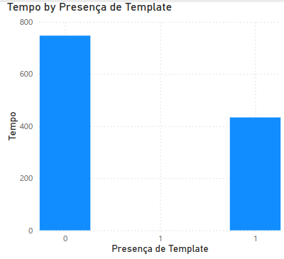
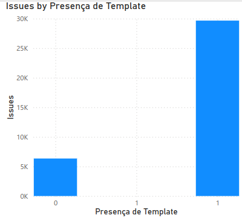

# Laboratório 4

# Lab 03

Integrantes:

- Fernando Couto
- Tito Chen
- Vinicius Lima

## Introdução

**Objetivo**: Um estudo preliminar da adoção de funcionalidades nativas de caracterização de issues e seus impactos.

**Linguagem de programação**: Python 3

**Ferramenta de Visualização**: Power BI

**API utilizada**: GitHub GraphQL API

## RQS 

- **RQ01**: Comparativo entre o uso de funcionalidades de caracterização das issues para contribuem para a resolução rápida e efetiva.

- **RQ02**: O uso de templates afeta a velcidade de resolução? Dos repositórios que utilizam templates, quantos usam as funcionalidades?

## Metodologia

### Coleta de dados

Utilizamos a API do GitHub para coletar 36.008 issues entre os 814 repositórios mais populares do github.

### Processamento de dados

Os dados foram salvos em um banco de dados local SQLite, e posteriormente exportamos o mesmo para um csv para realizar as análises pelo Power BI

### Análise de dados

Foi utilizada a ferramenta Power BI para gerar os gráficos apresentados abaixo para responder os nossos RQs

## Resultados

### RQ01 Comparativo entre o uso de funcionalidades de caracterização das issues para contribuem para a resolução rápida e efetiva.

Realizamos uma análise do uso de diferentes funcionalidades na criação de issues, comparando o tempo de resolução entre aquelas que utilizaram e as que não utilizaram cada uma das funcionalidades. As funcionalidades avaliadas foram:

- Checklist
- Links
- Trechos de código
- Imagens
Por fim, comparamos o tempo de resolução das issues que utilizaram pelo menos uma dessas funcionalidades com o tempo das que não utilizaram nenhuma.

Segue abaixo os resultados das comparações de cada funcionalidade:

Segue abaixo os resultados das comparações de issues que utilizaram pelo menos uma das funcionalidades vs issuess que não utilizaram nenhuma:

### RQ02 O uso de templates afeta a velcidade de resolução? Dos repositórios que utilizam templates, quantos usam as funcionalidades?

Para responder a essa pergunta, geramos dois gráficos. O primeiro mostra a média de tempo de resolução das issues que utilizam templates, enquanto o segundo apresenta o número total de issues criadas a partir de um template.

## Discussão
Os dados mostram que issues criadas com funcionalidades nativas do GitHub apresentam um tempo de resposta menor em comparação às criadas sem essas funcionalidades, evidenciando uma correlação positiva entre o uso dessas ferramentas e a qualidade das issues criadas.

Quanto aos templates de issues, observamos que a maioria das issues nesses projetos foram criadas a partir de templates, o que destaca a importância dos templates para facilitar um processo eficiente e padronizado entre a comunidade e os desenvolvedores de projetos open source. Além disso, issues criadas com o auxílio de templates também apresentaram um tempo de resposta menor em comparação às que foram criadas sem eles, indicando que a padronização e a clareza proporcionadas pelos templates contribuem para uma resolução mais ágil.

## Conclusão

Esses resultados sugerem que o uso das funcionalidades e templates do GitHub são fatores importantes para melhorar a comunicação, a organização e a eficiência no tratamento de issues, beneficiando toda a comunidade envolvida.

