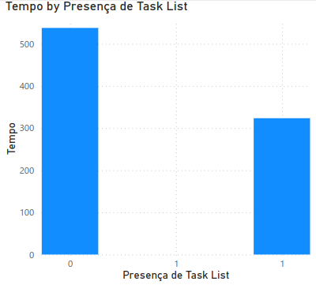
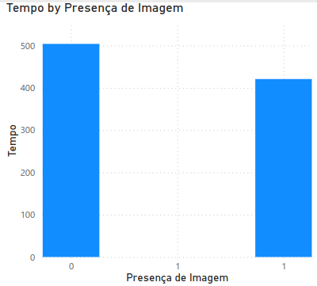

# Laboratório 4

# Lab 03

Integrantes:

- Fernando Couto
- Tito Chen
- Vinicius Lima

## Introdução

**Objetivo**: Um estudo preliminar da adoção de funcionalidades nativas de caracterização de issues e seus impactos.

**Linguagem de programação**: Python 3

**Ferramenta de Visualização**: Power BI

**API utilizada**: GitHub GraphQL API

## Hipóteses informais

- **RQ01**: Comparativo entre o uso de funcionalidades de caracterização das issues para contribuem para a resolução rápida e efetiva.

- **RQ02**: O uso de templates afeta a velcidade de resolução? Dos repositórios que utilizam templates, quantos usam as funcionalidades?

## Metodologia

## Resultados

### RQ01

Realizamos uma análise do uso de diferentes funcionalidades na criação de issues, comparando o tempo de resolução entre aquelas que utilizaram e as que não utilizaram cada uma das funcionalidades. As funcionalidades avaliadas foram:

- Checklist
- Links
- Trechos de código
- Imagens
Por fim, comparamos o tempo de resolução das issues que utilizaram pelo menos uma dessas funcionalidades com o tempo das que não utilizaram nenhuma.

Segue abaixo os resultados das comparações de cada funcionalidade:

Segue abaixo os resultados das comparações de issues que utilizaram pelo menos uma das funcionalidades vs issuess que não utilizaram nenhuma:

Dashboard com as issues resolvidas mais rapidamente

Dashboard com as issues resolvidas mais lentamente

## Discussão

## Conclusão

